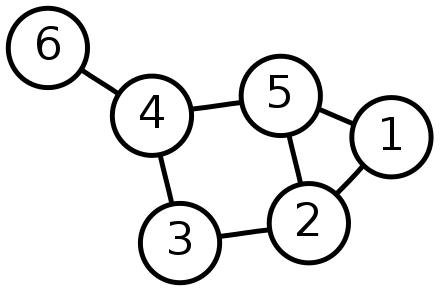

<!-- omit in toc -->
Problem Set 3
==================

<div style="background-color: #fff3cd; color: #856404; padding: 15px; margin-bottom: 25px; border: 1px solid #ffeeba; border-radius: 4px;">
  
  <strong>Showing your work</strong> 
  <p>
    Your homework assignments should show incremental development with at least two different commits over two different days of work. Assignments that do not show incremental development will incur a 5% penalty.
  </p>

  <strong>Reminder: No AI Tools</strong>
  <p>
According to MSSE Department policy, use of AI tools is not permitted in Chem 274A. Do not use generative AI tools (e.g., ChatGPT, Claude, GitHub Copilot, or similar) for any part of this assignment, including planning, coding, or writing.
  </p>
</div>

<!-- omit in toc -->
Contents
--------
- [Python - Molecules as Graphs](#python---molecules-as-graphs)
  - [Questions](#questions)
  - [Files](#files)
- [C++ - Generic printing function](#c---generic-printing-function)
  - [Overloading the stream insertion operator](#overloading-the-stream-insertion-operator)
- [C++ - More molecule functionality](#more-molecule-functionality)

Python - Molecules as Graphs
----------------------------
So far in this course, we've talked about running molecular mechanics and quantum chemistry simulations of molecules.
But, how do you store information about molecules in databases?
Or, if you have a set of molecules, how do you determine which molecules are similar to one another?
When you have a large amount of data, visual inspection to determine similarity or equivalence is impractical. 
It also requires high skill and may be prone to errors.
Thus, for cheminformatics or machine learning applications, we have to be able to express a molecule mathematically.

Many of the representations for small molecules that are used in cheminformatics and drug discovery are based on representing molecules using graph theory. There are algorithms and molecular representations that build on top of this concept. 

A mathematical graph is made up of "nodes" or "vertices" (circles in the image below) and "edges" which connect nodes (line between circles in the image below).

<center>


**Figure 1** - A depiction of a graph with six nodes and seven edges. [source](https://en.wikipedia.org/wiki/Graph_theory)
</center>

When molecules are represented as graphs, the atoms are represented as nodes in the graph, and the bonds are represented as edges.

In this homework, you will use a Python library called [NetworkX](https://networkx.org/) for graph representation.
You will also implement your own ring finding algorithm.
However, if you were working on a real molecular application, you would likely use a specialized library like [RDKit](https://www.rdkit.org/) instead (we will use this library in a later lab!).

Your task for this homework is to use Python to represent molecular information read from a [Structured data File (sdf)](https://chem.libretexts.org/Courses/Intercollegiate_Courses/Cheminformatics/02%3A_Representing_Small_Molecules_on_Computers/2.05%3A_Structural_Data_Files) as a graph. You have been provided with a function called `parse_sdf` in `read.py` which will return a list of elements and bonds from an sdf file.

You will use a Python library called [NetworkX](https://networkx.org/) to create a graph from molecular information read from an SDF.
You can then use graph functions to determine things about the molecular structure, such as the presence of rings.

Your code should create a graph using the information from the sdf. 
You should then print out the number of rings in the molecule and the number of atoms in each ring. You should also use NetworkX to create a visualization of the network and save it to a file.

Your code should include:

1. A function called `create_graph` to create a NetworkX graph from the output of `parse_sdf`. Each atom should be a node and each bond should be an edge. The function signature should be
```
def create_graph(nodes: list[tuple], edges: list[tuple]) -> nx.Graph:
```
2. A function called `count_rings` that takes in the graph you created in (1). Your function should calculate the number of rings (cycles) in the molecule and the number of atoms in each ring using NeworkX. You will have to consult the NetworkX documentation to find an appropriate method. You should return your results as a tuple with the first element being the number of rings and the second element being a list of the number of atoms in each ring. The function signature should be
```
def count_rings(graph: nx.Graph) -> tuple[int, list[int]]:
```
3. A function called `visualize_molecule` that takes in an graph created by (1) and **saves** an image. Create a visualization of your molecule with `nx.draw_network`. Label the nodes in the visualization with the atom elements. You should also color the nodes by element using [CPK coloring](https://en.wikipedia.org/wiki/CPK_coloring).

### Starting Code
For this homework, you have been provided with:

1. `read.py` - Contains a `parse_sdf` function that reads a Structured Data File and returns molecular information as two lists: (1) A list of tuples representing atoms: `[(atom_id, element), ...]` (2) A list of tuples representing bonds (edges): `[(atom1_id, atom2_id), ...]`
---

## Reflection Questions

<div style="background-color: #e7f3fe; color: #0c5460; padding: 15px; margin-bottom: 25px; border: 1px solid #b8daff; border-radius: 4px;">

  <strong>Answering Reflection Questions</strong>
  <p>
    Your written answers should be <em>complete explanations</em>, not short phrases. A complete answer:
  </p>
  <ul>
    <li>References specific Python concepts, data types, or library features relevant to the question.</li>
    <li>Explains the reasoning and constraints, not just what you did (say <em>why</em> a particular approach works or doesn't work).</li>
    <li>Uses correct terminology from Python programming and graph theory where appropriate.</li>
    <li>Is written in full sentences and paragraphs.</li>
  </ul>
  <p>
    <strong>Grading:</strong> Full credit requires answers that demonstrate understanding of underlying concepts and explain <em>why</em>. Answers that only describe what you did without explanation will receive partial credit.
  </p>
</div>

---

### Questions
Answer these questions in your `README.md`. 

1. NetworkX nodes must be **hashable**. What does this mean, and what constraint does it place on what data types you can use for nodes? What data type did you choose to represent your nodes, and why? 

2. For this assignment, you were instructed to write functions rather than use object-oriented programming. Do you think functions or classes are more appropriate for this task? Justify your answer by considering: what state needs to be managed, what operations need to be performed, and whether the NetworkX Graph object already provides what you need.

3. Use [PubChem](https://pubchem.ncbi.nlm.nih.gov/) to get an SDF file for a molecule of choice and use your code to analyze it. What molecule did you choose and why? Report the number of rings and atoms in each ring that your code found.

### Files
Include the following files in your repo:
1. Your code which can create a NetworkX network from information in an SDF file. Remember that this should be in a file named `molecule_graph.py`.
2. A `README.md` which explains the repo purpose and how to run the code in your project.
3. A `Makefile` with the following targets:
   1. `environment` - creates the Python environment needed to run your code. Note that you will need to create an install libraries you need like NetworkX. Name your environment `problem_set_3` EXACTLY. Match this case exactly or the autograder will not be able to find your environment.
   2. `visualize` - create a visualization of the molecule you chose for (3) and save a png image.
   3. `analyze` - run your code on the molecule you chose for (3) and print out the number of rings and the number of atoms in each ring.
   4. `clean` - remove images from `visualize` or any files created by `analyze`.

If you're interested in learning more about molecular representations, you might consider checking out the following review: ["Molecular representations in AI‑driven drug
discovery: a review and practical guide"](https://jcheminf.biomedcentral.com/articles/10.1186/s13321-020-00460-5)

C++ - Generic printing function
-------------------------------

Write a (templated) function that takes in an std::vector containing any type, and
then loops over it and prints all the contents, with each element of the vector
on its own line.


### Overloading the stream insertion operator

In C++, you can overload the stream insertion operator (`<<`). You can do
this by writing a function that takes in two arguments, one being the output
stream object, and the second argument being what is going to be inserted. In
this case, the first argument is a generic `std::ostream` (output stream)
object, and the second is what you want to print.

We will cover streams in a little more detail in Week 9. However, we will just
say now that `std::cout` is a type of `std::ostream`. Therefore, by overloading
this operator we can say `std::cout << vec`.

The function should return the `std::ostream` object that was passed in. This
is what allows chaining calls to the operator `<<`. Of course, this function
can be templated!


    std::ostream & operator<<(std::ostream & os, ...)
    {
        return os;
    }


## More molecule functionality

Once again, `molecule.cpp` includes a molecule class. This is largely the class from the previous
problem set, however some of the functions have been given to you.

One main difference is that the `Atom` structure now includes the atomic symbol (as a string) rather
than the atomic number.

You need to add some functionality:

* Accessing the individual `Atom`s via the subscript operator `[]` (for example, `mol[2]` rather than `mol.get_atom(2)`). The returned `Atom` should be modifiable. You must include the const version of this function as well.
* Ability to print the molecule using the stream insertion operator. You should use the function
  written in the previous part of this problem set.
* A function to compute the molecular weight
* A function to compute the nuclear repulsion energy (see below)

The only information you have for the atoms is the symbol, therefore the latter two functions will require two lookup tables - one for the
nuclear charge (usually denoted as $Z$, hydrogen = 1, carbon = 6, etc) and the atomic masses.

For reference, here are the atomic masses of 4 of the more common elements:


| Element | Mass           |
|---------|----------------|
| H       | 1.007825032    |
| C       | 12.011         |
| N       | 14.007         |
| O       | 15.99491462    |


### Nuclear Repulsion Energy

One component of the total molecular energy is the "nuclear repulsion energy". All nuclei are positively charged, so when nuclei are
within close range of each other (like in a molecule), they will repel each other. This repulsion can be calculated via

$$
E_{nuc} = \sum_{A}\sum_{B>A} \frac{Z_A Z_B}{r_{AB}}
$$

Where $Z_A$,$Z_B$ is the nuclear charge of atoms $A$ and $B$, respectively, and $r_{AB}$ is the distance between the to atoms.
In atomic units, the nuclear charge is the same as the atomic number (number of protons) - that is, a proton has a charge of 1.

**Note** - You must compute this only over distinct pairs of different atoms - do not double count pairs (for example, with pair (1,2) and then later (2,1)).

**Hint** - The nuclear repulsion energy for the water molecule in the `main` function is approximately +6.68 Hartrees. The energy is positive because it is repulsive.

<script type="text/javascript" src="http://cdn.mathjax.org/mathjax/latest/MathJax.js?config=TeX-AMS-MML_HTMLorMML"></script>
<script type="text/x-mathjax-config">
    MathJax.Hub.Config({ tex2jax: {inlineMath: [['$', '$']]}, messageStyle: "none" });
</script>


### Questions

Place answers to these questions in the README file that you used in the Python section above.

1. When overloading the stream insertion operator

    1. Why do take in the stream object as a non-`const` reference?

    1. The `std::ostream` object is a base class for `std::cout` as well as other streams. Why are we using that rather
       than a specific type?

1. Why do we need both a `const` and a non-`const` version of the subscript operator? When is one called over the other?

    1. For the `const` version, what is the type of object you returned (reference or copy)? What would be the advantage to returning
       one or the other?

1. What data type(s) did you use for the lookup tables for atomic data? Why did you choose that?